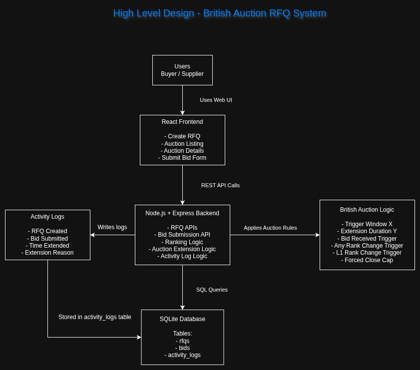

# British Auction RFQ System

A simplified RFQ system that supports British Auction-style bidding with automatic extensions, forced close rules, configurable auction behavior, auction listing/details pages, activity logs, backend APIs, frontend UI, database schema, and HLD.

## Stack

- Frontend: React + Vite
- Backend: Node.js + Express
- Database: SQLite

## How to Run

### Backend

```bash
cd backend
npm install
npm run dev
```

Backend runs on:

```txt
http://localhost:5000
```

### Frontend

Open another terminal:

```bash
cd frontend
npm install
npm run dev
```

Frontend runs on:

```txt
http://localhost:5173
```

```md
## HLD / Architecture

The following diagram shows the high-level architecture of the British Auction RFQ System.



## Database Schema

### rfqs

| Column | Purpose |
|---|---|
| id | Primary key |
| name | RFQ name |
| reference_id | RFQ reference ID |
| is_british_auction | Whether British Auction is enabled |
| bid_start_time | Bid start date and time |
| bid_close_time | Current bid close date and time. This can be extended. |
| original_bid_close_time | Original bid close date and time |
| forced_bid_close_time | Absolute forced close date and time |
| pickup_service_date | Pickup / service date |
| trigger_window_minutes | X minutes |
| extension_duration_minutes | Y minutes |
| extension_trigger_type | BID_RECEIVED, ANY_RANK_CHANGE, L1_RANK_CHANGE |
| created_at | Creation timestamp |

### bids

| Column | Purpose |
|---|---|
| id | Primary key |
| rfq_id | Linked RFQ |
| carrier_name | Supplier / carrier name |
| freight_charges | Freight charges |
| origin_charges | Origin charges |
| destination_charges | Destination charges |
| transit_time | Transit time |
| quote_validity | Validity of quote |
| total_price | freight + origin + destination |
| created_at | Bid timestamp |

### activity_logs

| Column | Purpose |
|---|---|
| id | Primary key |
| rfq_id | Linked RFQ |
| type | RFQ_CREATED, BID_SUBMITTED, TIME_EXTENDED |
| message | Human-readable message |
| reason | Reason for extension/action |
| old_close_time | Old close time for extension |
| new_close_time | New close time for extension |
| created_at | Log timestamp |

## Backend API Endpoints

| Method | Endpoint | Purpose |
|---|---|---|
| GET | `/api/health` | Health check |
| POST | `/api/rfqs` | Create RFQ |
| GET | `/api/rfqs` | List all RFQs |
| GET | `/api/rfqs/:id` | Get RFQ details |
| POST | `/api/rfqs/:id/bids` | Submit supplier bid |

## British Auction Rules Implemented

1. RFQ can be created with British Auction enabled.
2. RFQ creation includes:
   - RFQ Name
   - Reference ID
   - Bid Start Date & Time
   - Bid Close Date & Time
   - Forced Bid Close Date & Time
   - Pickup / Service Date
3. Forced Bid Close Time must be greater than Bid Close Time.
4. Bid Start Time must be before Bid Close Time.
5. Bids are blocked before Bid Start Time.
6. Bids are blocked after current Bid Close Time.
7. Bids are blocked after Forced Bid Close Time.
8. Auction extensions never exceed Forced Bid Close Time.
9. Trigger Window X is implemented.
10. Extension Duration Y is implemented.
11. All three trigger types are implemented:
    - Bid received in last X minutes
    - Any supplier rank change in last X minutes
    - Lowest bidder / L1 rank change in last X minutes
12. Auction listing displays:
    - RFQ Name / ID
    - Current Lowest Bid
    - Current Bid Close Time
    - Forced Close Time
    - Auction Status
13. Auction details displays:
    - All bids sorted by price
    - Supplier ranking L1, L2, L3
    - Quote details
    - Auction configuration
    - Activity log with bid submissions, time extensions, and reasons

## Ranking Assumption

A supplier may submit multiple bids. For supplier ranking, each supplier is ranked by their best current bid, meaning their lowest submitted total price. Ties are broken by earlier bid time.

The details page still shows all individual bids sorted by total price.
